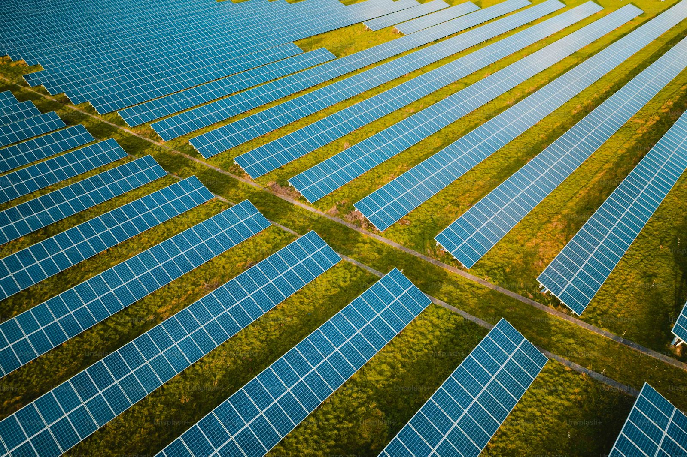
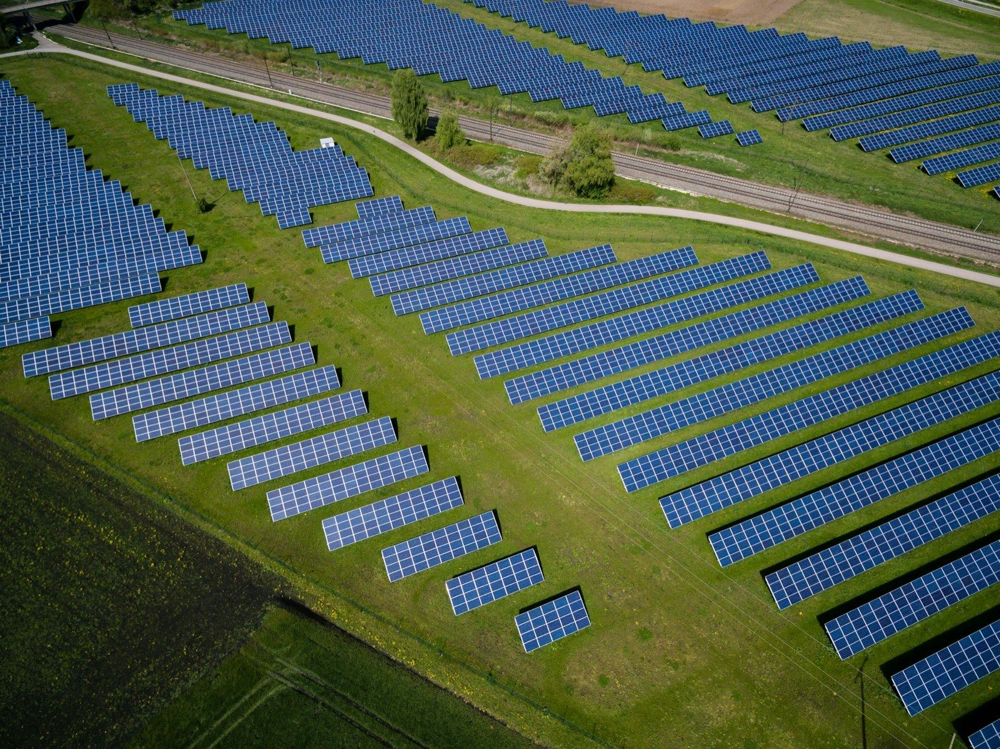

# 立德新能源 NULEIV — 網站設計稿

依據 0803 模擬稿的調性延伸，完成全站 15 個頁面並互相串連。
配色改為 **蒂芬妮藍漸變 → 白**，主選單 **置中**，版面 **滿版**，游標改為 **logo 水滴樣式**。

---

## 如何預覽

直接用瀏覽器開啟 `index.html` 即可（不需要安裝任何東西）。
若要以本機伺服器預覽：

```bash
python3 .claude/serve.py      # → http://127.0.0.1:4178
```

---

## 頁面結構

| 選單 | 檔案 |
|---|---|
| 首頁 | `index.html` |
| **服務項目** | `services.html` |
| ├ 光電系統工程 | `service-pv.html` |
| ├ 光電案場維運 | `service-om.html` |
| ├ 區域能源整合 | `service-regional.html` |
| ├ 能源資訊服務 | `service-data.html` |
| └ 綠電交易服務 | `service-trading.html` |
| 關於立德新能源 | `about.html` |
| **永續經營** | `sustainability.html` |
| ├ 碳盤查 | `sustain-carbon.html` |
| └ ESG | `sustain-esg.html` |
| 聯絡我們 | `contact.html` |
| **Q&A** | `faq.html`（`#green` 綠能相關／`#service` 服務相關） |
| 最新消息 | `news.html` ・ `news-detail.html`（內頁範例） |

`_reference/` 內保留客戶原始的 0803 模擬稿。

---

## 檔案說明

```
assets/
  css/main.css     設計系統（色票、字級、元件、RWD）— 全站唯一樣式檔
  js/layout.js     頁首／手機選單／頁尾／游標／載入動畫（全站共用，單一來源）
  js/art.js        以 SVG 程式產生的情境圖（solar / storage / grid / data /
                   leaf / city / trade / om / light）
  js/icons.js      流程圖示庫（38 枚線性圖示，24 網格／stroke 1.6）
  js/app.js        互動行為（游標、捲動、展開、分頁、篩選、數字動畫、表單）
  img/logo.jpg     主 logo（頁首）
  img/mark.jpg     logo 圖標（favicon）
```

### 選單只需要改一個地方
導覽列與頁尾是由 `assets/js/layout.js` 注入的。
要增減選單項目或改連結，只要修改該檔開頭的 `NAV` 陣列，15 個頁面會同步更新。

每個頁面用 `<body data-page="services" data-sub="service-pv">` 標示自己是哪一頁，
選單會自動顯示對應的 active 狀態。

---

## 版面系統

全站不使用卡片格狀。每頁依性質組合以下版面裝置（定義於 `main.css` 第 27a 節）：

| 裝置 | 用途 |
|---|---|
| `.stage` | 滿版影像區塊，圖填滿整區、文字疊在上面（`--tall` / `--mid` / `--short`） |
| `.chapter` | 整頁高的章節，搭配巨大描邊編號（服務項目頁） |
| `.index` | 滑過切換滿版背景的編號清單（首頁五大服務、永續兩大服務、相關服務） |
| `.steps` | 步驟流程圖：節點 + 連接線 + 方向箭頭（全站所有「流程」區塊） |
| `.ledger` | 細線分隔的編號清單，取代卡片（服務內容、里程碑） |
| `.figures` | 細線分隔的大數字／大標（實績數據、經營理念、ESG 三面向） |
| `.bleed-split` | 影像切齊畫面左或右緣的不對稱分割 |
| `.tile` | 無外框的靜態圖文項目（最新消息） |
| `.rail` | 右側章節進度指示器（服務項目頁） |
| `.gal` | 圖片輪播：左右鍵／點點／觸控滑動／鍵盤方向鍵，自動播放滑入即停（五個服務子頁的「服務內容」） |
| `.aud` | 「這項服務適合這些對象」的圖片卡格 |
| `.svc` | 「其他服務項目」的服務卡片格（預設 4 欄，`.svc--3` 為 3 欄） |

`.gal` 容器加 `data-gal-auto="0"` 可關閉自動播放，預設 6 秒換一張。

深色滿版 banner 的頁面在 `<body>` 加 `data-header="over"`，頁首在捲動前會轉為透明、logo 換成白色版本。

## 動態規範

客戶指定：**動態素材只出現在背景與 banner**，內容圖片維持靜態。

- `<div class="art" data-art="solar"></div>` — 會動（hero、章節背景、滿版區塊）
- `<div class="art" data-art="solar" data-static></div>` — 完全靜止（最新消息縮圖）

`data-static` 會剝除所有動畫 class 與 inline animation，已用自動化測試驗證為 0 個動畫節點。

## 流程區塊與圖示

全站所有「流程」都使用同一個 `.steps` 元件：

```html
<ol class="steps" data-stagger="110">
  <li class="step">
    <span class="step__link" aria-hidden="true"></span>      <!-- 連接線＋箭頭 -->
    <span class="step__node"><i class="ico" data-ico="survey"></i></span>
    <div class="step__body">
      <span class="step__n">01</span>
      <h3 class="step__t">場勘與資料蒐集</h3>
      <p class="step__d">說明文字</p>
    </div>
  </li>
</ol>
```

- 寬螢幕自動排成橫式流程圖，900px 以下自動轉為直式，不需要改 HTML
- `.steps--v` 強制直式（用於窄欄，如永續經營頁的減碳路徑）
- `.steps--ink` 深色底版本（用於滿版 banner 上，如聯絡我們頁）
- 連接線會隨捲動逐段畫出；最後一步的節點預設是實心漸變，代表終點
- 標題字數不同時，JS 會把同一列標題拉齊，說明文才會落在同一條基線上

圖示在 `assets/js/icons.js`，共 38 枚，皆為自製線性圖示（24 網格、stroke 1.6、
圓端圓角），與全站既有的箭頭／勾選圖示同一套筆法，沒有外部圖示字型。
要新增圖示就在該檔的 `I` 物件加一組 `名稱: '<path .../>'` 即可。

## 關於圖片

全站情境圖為 **實拍照片**，放在 `assets/img/photo/`，目前共 **7 張**（客戶提供）：

| 檔名 | 畫面內容 | 代表題材 |
|---|---|---|
| `solar-engineer.jpg` | 工程師在太陽能電廠以筆電檢查發電系統 | 光電工程、案場維運 |
| `switchboard.jpg` | 電氣技師以平板檢查配電盤迴路 | 電氣檢測、儲能、資訊服務 |
| `grid-tower.jpg` | 工程人員指向高壓輸電鐵塔 | 電網、區域能源整合 |
| `wind-farm.jpg` | 山稜線上的風力發電機 | 再生能源、綠電、永續 |
| `planning.jpg` | 專業人員在城市模型前討論規劃 | 顧問、簽約、團隊 |
| `city-tower.jpg` | 綠樹與玻璃帷幕商辦大樓 | 用電端、適用對象 |
| `green-building.jpg` | 植栽與自然採光的綠建築室內 | 綠建築、ESG、碳盤查 |

這 7 張要撐 15 頁、137 個圖片位置，平均每張重複約 20 次。
程式已讓**同一個 `<section>` 內不出現重複畫面**，但跨區塊仍會重複。
`CREDITS.md` 列出還缺哪幾類題材的照片，補齊後重複感會明顯下降。

**要換照片**：以同檔名覆蓋即可，版型與 HTML 都不用動。
建議長邊 1600px、JPG、單檔 300KB 以內。

HTML 裡的寫法：

```html
<!-- 滿版背景（stage / bleed-split / tile） -->


<!-- 有視差捲動的 hero，額外加 photo--para -->

```

`.photo` 已處理 `object-fit:cover` 與滿版定位，外層的圓角、陰影與遮罩都會沿用。

---

## 需要客戶確認／替換的內容

這份是設計稿，以下為**擬真示意內容**，正式上線前請提供實際資料替換：

- 首頁「用數字說明我們走到哪裡」的 4 組實績數字
- `about.html` 的發展里程碑年份與事件
- 各服務頁「規格」區塊的技術數值與保固條件
- `news.html` 的所有新聞標題與日期、`news-detail.html` 全文
- `contact.html` 的公司地址、電話、Email，以及 Google 地圖嵌入碼
- 頁尾的地址與聯絡資訊

另外需要工程端處理：

- **聯絡表單尚未串接後端**，目前送出只會顯示成功訊息（`app.js` 的 `form[data-demo]`）
- 頁尾的隱私權政策／使用條款／法律聲明連結、社群連結尚未指定網址
- 英文版（EN）切換按鈕尚未實作

---

## 設計規格

- **主色**：蒂芬妮藍 `#0ABAB5`，漸變至 `#4FC3E8` 與 logo 綠 `#9ED06A`，背景走白
- **字體**：Outfit（標題／數字）+ Hanken Grotesk + Noto Sans TC（內文）
- **容器**：最大寬度 1440px，滿版區塊（hero／深色區／CTA）延伸至整個視窗寬度
- **游標**：logo 水滴圖標 + 跟隨圓環；hover 連結時圓環放大、圖標縮小；
  觸控裝置與 `prefers-reduced-motion` 下自動停用
- **動畫**：跑馬燈、捲動淡入、數字累加、SVG 情境圖的脈動與流動線條
- **RWD 斷點**：1180 / 1040（切換漢堡選單）/ 860 / 640 / 560
- 已支援 `prefers-reduced-motion`，鍵盤 focus 可見
